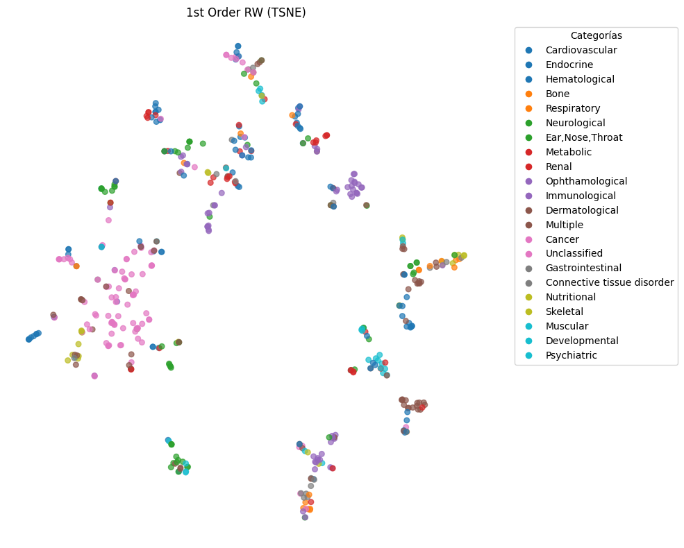
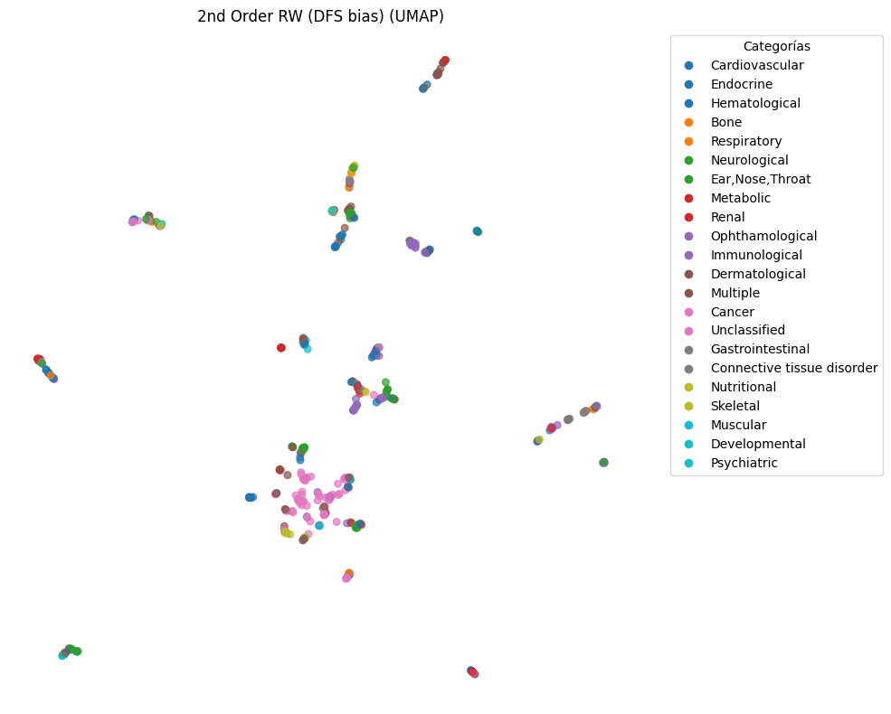
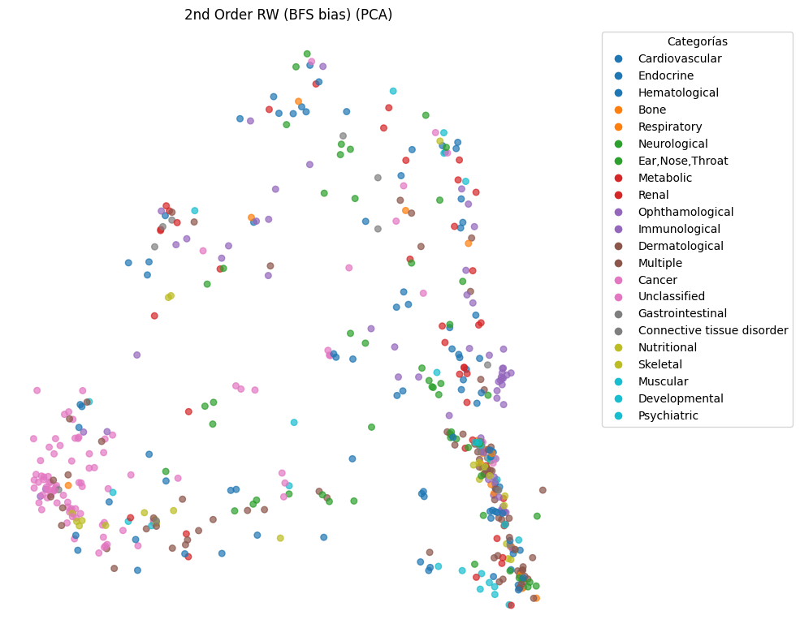

# GRL-HumanDiseaseNetwork

Este proyecto implementa y evalúa métodos de **Aprendizaje de Representación en Grafos (Graph Representation Learning - GRL)** basados en caminatas aleatorias (Random Walks) utilizando **Node2Vec** sobre la red de enfermedades humanas (**Human Disease Network** o *Diseasome*). El objetivo principal consiste en aprender representaciones vectoriales densas (embeddings) de baja dimensión para los nodos (enfermedades) y evaluar su calidad topológica a través de tareas posteriores (*downstream tasks*) de **visualización 2D**, **clustering (agrupamiento no supervisado)** y **clasificación supervisada** de las clases fisiológicas de enfermedad.

---

## 📂 Estructura del Proyecto

El desarrollo del proyecto está completamente documentado y ejecutable en:

*   **`GRLredes.ipynb`**: Notebook principal con la implementación, experimentos de entrenamiento de embeddings, optimización de hiperparámetros de clustering y clasificación, análisis crítico y conclusiones.
*   **`img/`**: Directorio de recursos visuales generados a partir de los análisis:
    *   `random_walk_clasico.png`: Proyección t-SNE de embeddings clásicos.
    *   `2ndOrderRW_SesgohaciaDFS.png`: Proyección UMAP de embeddings sesgados a profundidad (DFS).
    *   `2ndOrderRW_SesgohaciaBFS.png`: Proyección PCA de embeddings sesgados a anchura (BFS).
    *   `kmeans_silhouute_NMI.png`: Curvas de evolución de Silhouette e índice NMI para K-Means y HC.
    *   `dendongrama_jerarquico.png`: Dendrograma del agrupamiento jerárquico Ward.
    *   `dbscan_clusteres_NMI.png`: Búsqueda de rejilla de DBSCAN (NMI y número de clústeres frente a $\epsilon$).
    *   `heatmap_clasification.png`: Resumen comparativo de Macro F1-Score en clasificación.

*(Nota: Los archivos de datos `.csv`, `.edgelist`, `.labels` y los entornos de ejecución están configurados en el `.gitignore` para asegurar la reproducibilidad sin saturar el repositorio).*

---

## ⚙️ Descripción de la Red de Enfermedades (Diseasome)

La red utilizada es un grafo no dirigido y no ponderado obtenido a partir de datos biológicos reales:
*   **Nodos**: Representan diferentes enfermedades humanas (516 nodos válidos).
*   **Enlaces**: Conectan dos enfermedades si comparten al menos un gen mutado asociado a ambas patologías (1188 enlaces).
*   **Etiquetas**: Cada enfermedad está mapeada con su categoría fisiológica real (clase de enfermedad como *Cardiovascular*, *Neurological*, *Cancer*, etc.), sirviendo como verdad fundamental (*ground truth*) para evaluar las tareas supervisadas y no supervisadas.

---

## 🚀 Análisis y Resultados por Tarea

### TASK 1: Graph Representation Learning (GRL)
Se generaron embeddings de dimensión 64 explorando tres variantes de caminatas aleatorias en **Node2Vec**:
1.  **Caminata Aleatoria Clásica (Classic):** Configuración estándar de primer orden ($p = 1.0, q = 1.0$).
2.  **Sesgo en Profundidad (DFS_bias):** Configuración ($p = 1.0, q = 0.5$) que prioriza la exploración hacia adelante, capturando la **homofilia** de la red (comunidades genéticas locales).
3.  **Sesgo en Anchura (BFS_bias):** Configuración ($p = 0.5, q = 2.0$) que prioriza la exploración local e inmediata, capturando la **equivalencia estructural** (roles topológicos como *hubs* o puentes).

#### 📸 Comparativa de Visualizaciones (Reducción de Dimensionalidad)

Para evaluar si el espacio latente retiene la estructura comunitaria biológica, proyectamos las 64 dimensiones en 2D:

| **1st Order RW (Classic)** | **2nd Order RW (DFS Bias)** | **2nd Order RW (BFS Bias)** |
| :---: | :---: | :---: |
|  |  |  |
| *Visualización con t-SNE ($p=1.0, q=1.0$)* | *Visualización con UMAP ($p=1.0, q=0.5$)* | *Visualización con PCA ($p=0.5, q=2.0$)* |

*   **Conclusión Visual:** El sesgo **DFS** visualizado con **UMAP** produce los clústeres más compactos y biológicamente diferenciados. Por el contrario, la equivalencia estructural (**BFS**) proyectada con **PCA** mezcla las categorías, lo que demuestra que PCA (lineal) y la métrica BFS no están alineadas con la segmentación visual directa de clases de enfermedades.

---

### TASK 2: Clustering (Análisis de Agrupamiento No Supervisado)
Se evaluó la capacidad de reconstruir las clases de enfermedades reales utilizando tres algoritmos de clustering con distintas métricas de distancia (Euclídea y Coseno):
1.  **K-Means** (Distancia Euclídea).
2.  **Clustering Jerárquico (HC)** (Enlace Ward con Euclídea vs. Enlace Promedio con Coseno).
3.  **DBSCAN** (Búsqueda en rejilla de hiperparámetros $\epsilon$ y `min_samples` bajo distancia de Coseno).

#### 📊 Tabla Comparativa Global de Modelos de Clustering

| Algoritmo | Mejor Embedding | Parámetros Óptimos | Silhouette Score | NMI (Extrínseco) | ARI (Extrínseco) |
| :---: | :---: | :---: | :---: | :---: | :---: |
| **K-Means (Euclidean)** | `DFS_bias` | $K = 95$ | 0.3380 | **0.5363** | 0.0830 |
| **HC (Cosine)** | `DFS_bias` | $K = 95$ | 0.3545 | 0.5206 | 0.0956 |
| **DBSCAN (Cosine)** | `BFS_bias` | $\epsilon = 0.10, min\_samples = 2$ | **0.5567** | 0.4973 | **0.1092** |

#### 📸 Gráficos de Evaluación y Jerarquía

| **Evaluación K-Means e Hierárquico** | **Dendrograma de Clustering Jerárquico** |
| :---: | :---: |
|  |  |
| *Silhouette vs K (K-Means) y NMI vs K (HC Coseno)* | *Dendrograma con enlace Ward sobre DFS_bias* |

| **Evaluación DBSCAN** |
| :---: |
|  |
| *NMI y número de clústeres frente a epsilon ($\epsilon$)* |

*   **Importancia de la distancia del Coseno:** En espacios de alta dimensionalidad (64D), la similitud del Coseno supera consistentemente a la Euclídea debido a la *maldición de la dimensionalidad*. El Clustering Jerárquico y DBSCAN con Coseno obtuvieron un Silhouette superior.
*   **Comportamiento de DBSCAN:** Logra un Silhouette óptimo (0.5567) al aislar eficazmente "enfermedades huérfanas" y periféricas como ruido (puntos marcados con `-1`) sin forzarlas a integrarse en clústeres artificiales.
*   **Dendrograma Ward:** Refleja con precisión las **taxonomías anidadas** intrínsecas en la medicina clínica (macro-categorías que engloban patologías muy específicas).

---

### TASK 3: Classification (Clasificación Supervisada)
Entrenamos clasificadores para predecir la variable objetivo `DiseaseClass` a partir de las características aprendidas por los embeddings. Se implementaron tres modelos bajo validación cruzada estratificada rigurosa de 5 particiones (`StratifiedKFold = 5`):
1.  **Regresión Logística** (con previa normalización L2 para emular similitud coseno).
2.  **Random Forest** (robusto al desbalance de clases usando `class_weight='balanced'`).
3.  **Support Vector Machine (SVM)** (con kernel lineal y RBF).

Adicionalmente, se generó un cuarto conjunto de características concatenado (**`Concat`**) uniendo los embeddings de `DFS_bias` (comunidades) y `BFS_bias` (roles) sumando un total de 128 dimensiones.

#### 📊 Resumen de Resultados de Clasificación (Top 10 Configuraciones)

| Posición | Embedding | Modelo Clasificador | Macro F1-Score | Weighted F1-Score | Balanced Accuracy | Hiperparámetros Óptimos |
| :---: | :---: | :---: | :---: | :---: | :---: | :--- |
| **1** | `Concat` | `RandomForest_with_Sel` | **0.4467** | 0.5497 | 0.4498 | `{'clf__max_depth': None, 'clf__n_estimators': 200, 'feat_sel__k': 'all'}` |
| **2** | `Concat` | `RandomForest_no_Sel` | **0.4467** | 0.5497 | 0.4498 | `{'clf__max_depth': None, 'clf__n_estimators': 200}` |
| **3** | `DFS_bias` | `RandomForest_with_Sel` | **0.4413** | 0.5369 | 0.4433 | `{'clf__max_depth': None, 'clf__n_estimators': 200, 'feat_sel__k': 64}` |
| **4** | `DFS_bias` | `RandomForest_no_Sel` | **0.4413** | 0.5369 | 0.4433 | `{'clf__max_depth': None, 'clf__n_estimators': 200}` |
| **5** | `Classic` | `RandomForest_with_Sel` | **0.4326** | 0.5330 | 0.4424 | `{'clf__max_depth': None, 'clf__n_estimators': 200, 'feat_sel__k': 32}` |
| **6** | `BFS_bias` | `RandomForest_with_Sel` | **0.4224** | 0.5216 | 0.4324 | `{'clf__max_depth': 10, 'clf__n_estimators': 200, 'feat_sel__k': 64}` |
| **7** | `BFS_bias` | `RandomForest_no_Sel` | **0.4224** | 0.5216 | 0.4324 | `{'clf__max_depth': 10, 'clf__n_estimators': 200}` |
| **8** | `BFS_bias` | `SVM` | **0.4208** | 0.5089 | **0.4511** | `{'clf__C': 1.0, 'clf__kernel': 'rbf', 'feat_sel__k': 16}` |
| **9** | `Classic` | `RandomForest_no_Sel` | **0.4170** | 0.5301 | 0.4288 | `{'clf__max_depth': None, 'clf__n_estimators': 100}` |
| **10** | `Concat` | `SVM` | **0.4078** | 0.5103 | 0.4381 | `{'clf__C': 1.0, 'clf__kernel': 'rbf', 'feat_sel__k': 'all'}` |

#### 📸 Heatmap de Desempeño (Macro F1-Score)

El siguiente heatmap ilustra la interacción entre la estrategia de embedding y el algoritmo supervisado:

  
   
  <em>Rendimiento (Macro F1-Score) por Modelo y Estrategia de Embedding</em>

#### ⚖️ El Impacto del Desbalanceo y Evaluación con SMOTE
El dataset presenta un **Imbalance Ratio (IR) crítico de 29.33** (clases con cientos de enfermedades y clases minoritarias con menos de 10 muestras). Esto explica la brecha sustancial entre el *Weighted F1* (~0.55) y el *Macro F1* (~0.44), ya que las clases mayoritarias inflan el rendimiento promedio ponderado.

Para abordar esto, se integró la técnica de sobremuestreo **SMOTE** dentro del pipeline de validación cruzada (previniendo *Data Leakage*) para expandir sintéticamente las clases minoritarias sobre el mejor escenario: **Random Forest + Concat**.

*   **Comparativa Directa (Con vs. Sin SMOTE):**
    *   **Macro F1 (Baseline):** **0.4467** $\rightarrow$ **Con SMOTE:** **0.4270** (Caída del **-4.4%**)
    *   **Balanced Accuracy (Baseline):** **0.4498** $\rightarrow$ **Con SMOTE:** **0.4355** (Caída del **-3.2%**)
*   **Conclusión Crítica:** La aplicación de SMOTE en este espacio latente concatenado de 128 dimensiones resultó contraproducente. La interpolación lineal sintética introdujo ruido y solapamiento entre fronteras de decisión de patologías complejas, desdibujando la topología de la red. Por lo tanto, el modelo RandomForest entrenado sobre los embeddings originales sin sobremuestreo se consolida como la estrategia más robusta.

---

## 🛠️ Tecnologías y Requisitos

El entorno está preparado utilizando `uv` o `pip` con las siguientes dependencias clave instaladas:
*   `networkx` para la manipulación y análisis del grafo de enfermedades.
*   `node2vec` para la generación de caminatas aleatorias de segundo orden y entrenamiento de representaciones latentes.
*   `scikit-learn` para pipelines, GridSearch, métricas de clustering (Silhouette, NMI, ARI) y clasificadores supervisados.
*   `imbalanced-learn` para la integración de `SMOTE` en la validación cruzada sin fuga de datos.
*   `umap-learn` para la reducción no lineal de dimensionalidad y visualización avanzada.
*   `seaborn` y `matplotlib` para la generación de la galería gráfica del proyecto.
