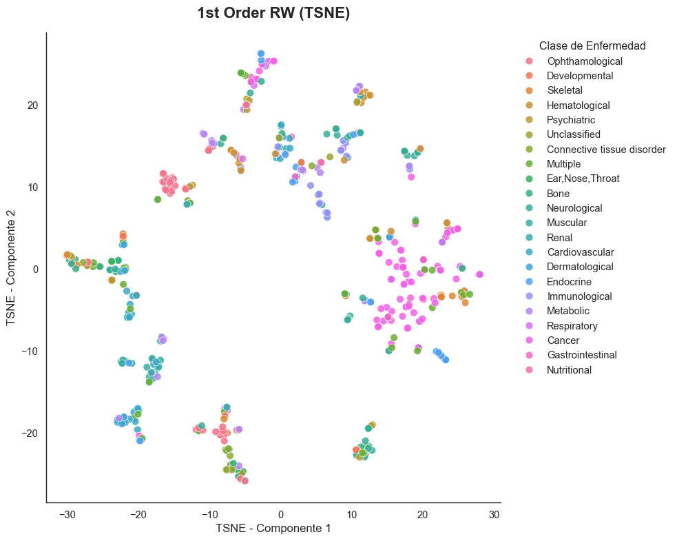
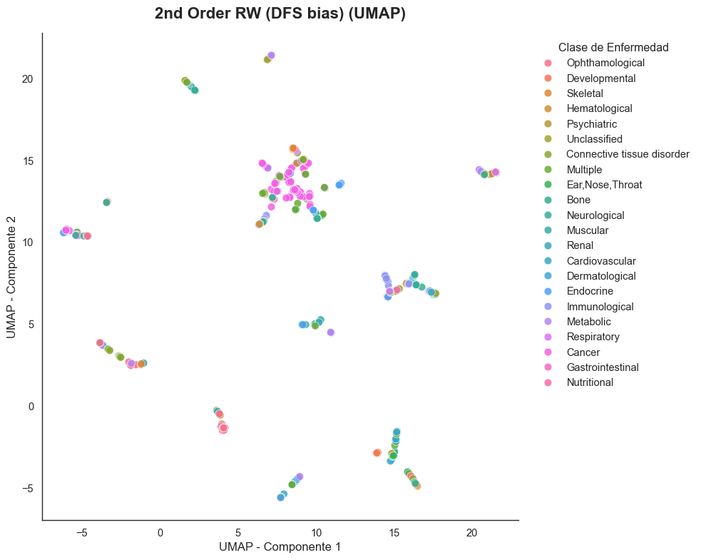
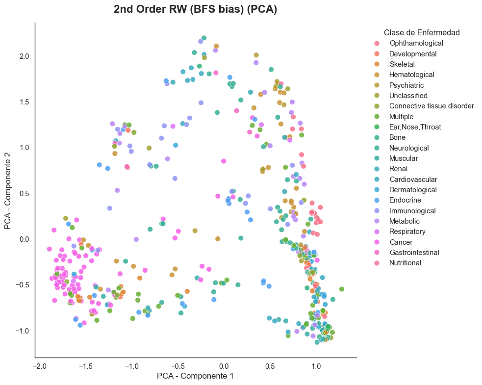
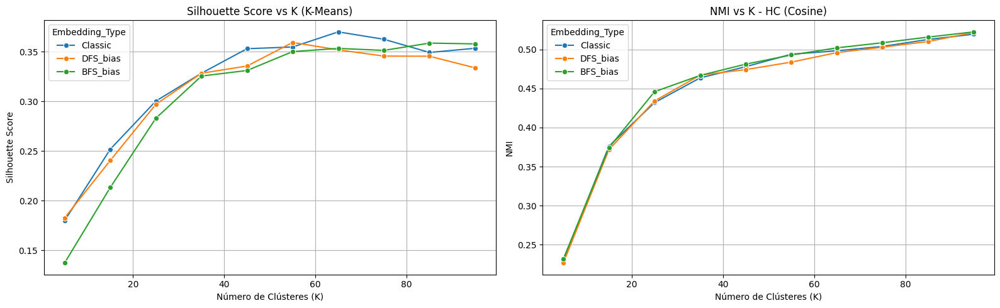
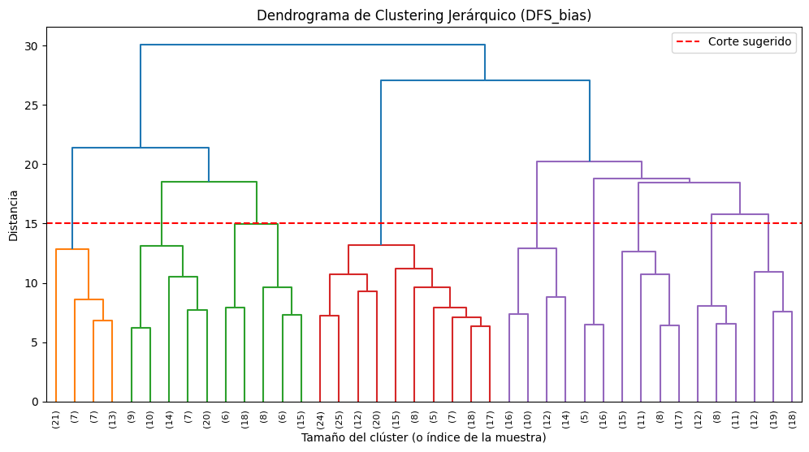
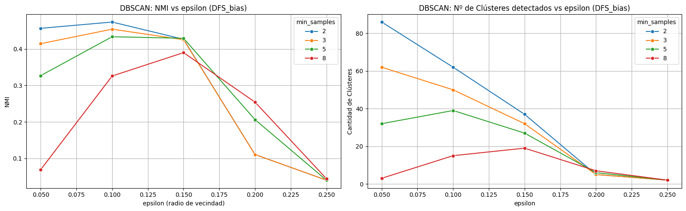
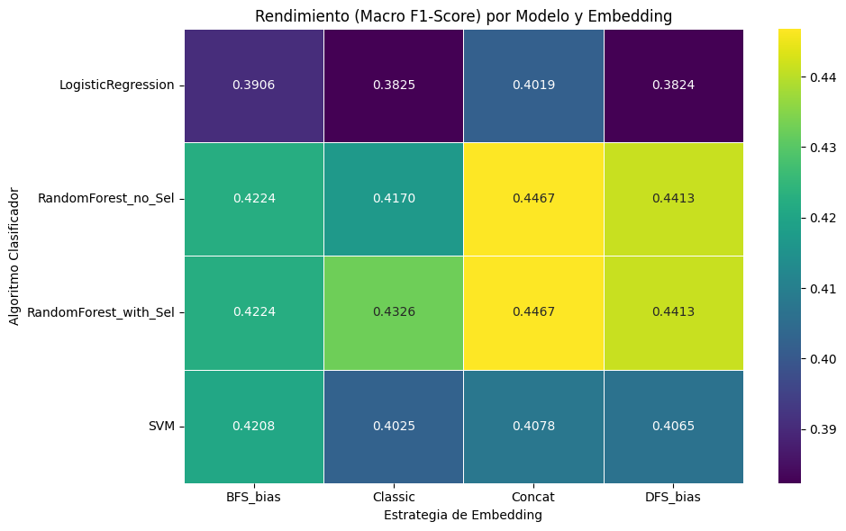

# GRL-HumanDiseaseNetwork

Este proyecto implementa y evalúa métodos de **Aprendizaje de Representación en Grafos (Graph Representation Learning - GRL)** basados en caminatas aleatorias (Random Walks) utilizando **Node2Vec** sobre la red de enfermedades humanas (**Human Disease Network** o *Diseasome*). El objetivo principal consiste en aprender representaciones vectoriales densas (embeddings) de baja dimensión para los nodos (enfermedades) y evaluar su calidad topológica a través de tareas posteriores (*downstream tasks*) de **visualización 2D**, **clustering (agrupamiento no supervisado)** y **clasificación supervisada** de las clases fisiológicas de enfermedad.

---

## 📂 Estructura del Proyecto

El desarrollo del proyecto está completamente documentado y ejecutable en:

*   **`GRLredes.ipynb`**: Notebook principal con la implementación, experimentos de entrenamiento de embeddings, optimización de hiperparámetros de clustering y clasificación, análisis crítico y conclusiones.
*   **`img/`**: Directorio de recursos visuales generados a partir de los análisis:
    *   `exp1_tsne.png`: Proyección t-SNE de embeddings clásicos.
    *   `exp2_umap.png`: Proyección UMAP de embeddings sesgados a profundidad (DFS).
    *   `exp3_pca.png`: Proyección PCA de embeddings sesgados a anchura (BFS).
    *   `kmeans_silhouute_NMI.png`: Curvas de evolución de Silhouette e índice NMI para K-Means y HC.
    *   `dendongrama_jerarquico.png`: Dendrograma del agrupamiento jerárquico Ward.
    *   `dbscan_clusteres_NMI.png`: Búsqueda de rejilla de DBSCAN (NMI y número de clústeres frente a $\epsilon$).
    *   `heatmap_clasification.png`: Resumen comparativo de Macro F1-Score en clasificación.

*(Nota: Los archivos de datos `.csv`, `.edgelist`, `.labels` y los entornos de ejecución están configurados en el `.gitignore` para asegurar la reproducibilidad sin saturar el repositorio).*

---

## ⚙️ Descripción de la Red de Enfermedades (Diseasome)

La red utilizada es un grafo no dirigido y no ponderado obtenido a partir de datos biológicos reales:
*   **Nodos**: Representan diferentes enfermedades humanas (516 nodos válidos).
*   **Enlaces**: Conectan dos enfermedades si comparten al menos un gen mutado asociado a ambas patologías (1188 enlaces).
*   **Etiquetas**: Cada enfermedad está mapeada con su categoría fisiológica real (clase de enfermedad como *Cardiovascular*, *Neurological*, *Cancer*, etc.), sirviendo como verdad fundamental (*ground truth*) para evaluar las tareas supervisadas y no supervisadas.

---

## 🚀 Análisis y Resultados por Tarea

### TASK 1: Graph Representation Learning (GRL)
Se generaron embeddings de dimensión 64 explorando tres variantes de caminatas aleatorias en **Node2Vec**:
1.  **Caminata Aleatoria Clásica (Classic):** Configuración estándar de primer orden ($p = 1.0, q = 1.0$).
2.  **Sesgo en Profundidad (DFS_bias):** Configuración ($p = 1.0, q = 0.5$) que prioriza la exploración hacia adelante, capturando la **homofilia** de la red (comunidades genéticas locales).
3.  **Sesgo en Anchura (BFS_bias):** Configuración ($p = 0.5, q = 2.0$) que prioriza la exploración local e inmediata, capturando la **equivalencia estructural** (roles topológicos como *hubs* o puentes).

#### 📸 Comparativa de Visualizaciones (Reducción de Dimensionalidad)

Para evaluar si el espacio latente retiene la estructura comunitaria biológica, proyectamos las 64 dimensiones en 2D:

| **1st Order RW (Classic)** | **2nd Order RW (DFS Bias)** | **2nd Order RW (BFS Bias)** |
| :---: | :---: | :---: |
|  |  |  |
| *Visualización con t-SNE ($p=1.0, q=1.0$)* | *Visualización con UMAP ($p=1.0, q=0.5$)* | *Visualización con PCA ($p=0.5, q=2.0$)* |

*   **Conclusión Visual:** El sesgo **DFS** visualizado con **UMAP** produce los clústeres más compactos y biológicamente diferenciados. Por el contrario, la equivalencia estructural (**BFS**) proyectada con **PCA** mezcla las categorías, lo que demuestra que PCA (lineal) y la métrica BFS no están alineadas con la segmentación visual directa de clases de enfermedades.

---

### TASK 2: Clustering (Análisis de Agrupamiento No Supervisado)
Se evaluó la capacidad de reconstruir las clases de enfermedades reales utilizando tres algoritmos de clustering con distintas métricas de distancia (Euclídea y Coseno):
1.  **K-Means** (Distancia Euclídea).
2.  **Clustering Jerárquico (HC)** (Enlace Ward con Euclídea vs. Enlace Promedio con Coseno).
3.  **DBSCAN** (Búsqueda en rejilla de hiperparámetros $\epsilon$ y `min_samples` bajo distancia de Coseno).

#### 📊 Tabla Comparativa Global de Modelos de Clustering

| Algoritmo | Mejor Embedding | Parámetros Óptimos | Silhouette Score | NMI (Extrínseco) | ARI (Extrínseco) |
| :---: | :---: | :---: | :---: | :---: | :---: |
| **K-Means (Euclidean)** | `DFS_bias` | $K = 95$ | 0.3380 | **0.5363** | 0.0830 |
| **HC (Cosine)** | `DFS_bias` | $K = 95$ | 0.3545 | 0.5206 | 0.0956 |
| **DBSCAN (Cosine)** | `BFS_bias` | $\epsilon = 0.10, min\_samples = 2$ | **0.5567** | 0.4973 | **0.1092** |

#### 📸 Gráficos de Evaluación y Jerarquía

| **Evaluación K-Means e Hierárquico** | **Dendrograma de Clustering Jerárquico** |
| :---: | :---: |
|  |  |
| *Silhouette vs K (K-Means) y NMI vs K (HC Coseno)* | *Dendrograma con enlace Ward sobre DFS_bias* |

| **Evaluación DBSCAN** |
| :---: |
|  |
| *NMI y número de clústeres frente a epsilon ($\epsilon$)* |

#### Discusión de los resultados de Clustering

Los resultados obtenidos a partir de la aplicación de K-Means, Clustering Jerárquico y DBSCAN sobre las distintas representaciones latentes de la red revelan diferencias importantes según la métrica de distancia y la topología subyacente. En primer lugar, se observa que los métodos basados en la similitud del coseno (empleados en el agrupamiento jerárquico y DBSCAN) tienden a proporcionar agrupaciones más coherentes que aquellos basados en la distancia euclídea (K-Means). Este comportamiento es esperable en espacios latentes de alta dimensionalidad (64 dimensiones), donde la magnitud de los vectores pierde relevancia frente a la similitud angular para capturar la afinidad estructural entre nodos.

Respecto a la estrategia de exploración, el sesgo en profundidad (DFS) tiende a agrupar nodos de la misma vecindad local, promoviendo la homofilia y generando clústeres visualmente más compactos. Sin embargo, al incrementar la granularidad de la partición (por ejemplo, con $K=95$), la representación basada en anchura (BFS) alcanza valores competitivos en métricas de validación externa como el NMI. Esto indica que, a un nivel de segmentación más fino, la equivalencia estructural de los nodos —es decir, su rol topológico en la red, como cuellos de botella o *hubs* genéticos— presenta una alta correlación con subcategorías clínicas específicas.

Por último, al evaluar el comportamiento individual de los algoritmos, el Clustering Jerárquico destaca como un modelo equilibrado que refleja de forma natural las taxonomías médicas mediante su jerarquía anidada. DBSCAN, por su parte, consigue aislar nodos periféricos gracias a su enfoque basado en densidad, lo que resulta especialmente útil en este dominio para identificar enfermedades atípicas sin forzar su inclusión en clústeres mayores. En contraste, K-Means asume clústeres de forma esférica y tamaño similar, una restricción geométrica que limita su capacidad para adaptarse a las distribuciones irregulares propias de esta red biomédica.

---

### TASK 3: Classification (Clasificación Supervisada)
Entrenamos clasificadores para predecir la variable objetivo `DiseaseClass` a partir de las características aprendidas por los embeddings. Se implementaron tres modelos bajo validación cruzada estratificada rigurosa de 5 particiones (`StratifiedKFold = 5`):
1.  **Regresión Logística** (con previa normalización L2 para emular similitud coseno).
2.  **Random Forest** (robusto al desbalance de clases usando `class_weight='balanced'`).
3.  **Support Vector Machine (SVM)** (con kernel lineal y RBF).

Adicionalmente, se generó un cuarto conjunto de características concatenado (**`Concat`**) uniendo los embeddings de `DFS_bias` (comunidades) y `BFS_bias` (roles) sumando un total de 128 dimensiones.

#### 📊 Resumen de Resultados de Clasificación (Top 10 Configuraciones)

| Posición | Embedding | Modelo Clasificador | Macro F1-Score | Weighted F1-Score | Balanced Accuracy | Hiperparámetros Óptimos |
| :---: | :---: | :---: | :---: | :---: | :---: | :--- |
| **1** | `Concat` | `RandomForest_with_Sel` | **0.4467** | 0.5497 | 0.4498 | `{'clf__max_depth': None, 'clf__n_estimators': 200, 'feat_sel__k': 'all'}` |
| **2** | `Concat` | `RandomForest_no_Sel` | **0.4467** | 0.5497 | 0.4498 | `{'clf__max_depth': None, 'clf__n_estimators': 200}` |
| **3** | `DFS_bias` | `RandomForest_with_Sel` | **0.4413** | 0.5369 | 0.4433 | `{'clf__max_depth': None, 'clf__n_estimators': 200, 'feat_sel__k': 64}` |
| **4** | `DFS_bias` | `RandomForest_no_Sel` | **0.4413** | 0.5369 | 0.4433 | `{'clf__max_depth': None, 'clf__n_estimators': 200}` |
| **5** | `Classic` | `RandomForest_with_Sel` | **0.4326** | 0.5330 | 0.4424 | `{'clf__max_depth': None, 'clf__n_estimators': 200, 'feat_sel__k': 32}` |
| **6** | `BFS_bias` | `RandomForest_with_Sel` | **0.4224** | 0.5216 | 0.4324 | `{'clf__max_depth': 10, 'clf__n_estimators': 200, 'feat_sel__k': 64}` |
| **7** | `BFS_bias` | `RandomForest_no_Sel` | **0.4224** | 0.5216 | 0.4324 | `{'clf__max_depth': 10, 'clf__n_estimators': 200}` |
| **8** | `BFS_bias` | `SVM` | **0.4208** | 0.5089 | **0.4511** | `{'clf__C': 1.0, 'clf__kernel': 'rbf', 'feat_sel__k': 16}` |
| **9** | `Classic` | `RandomForest_no_Sel` | **0.4170** | 0.5301 | 0.4288 | `{'clf__max_depth': None, 'clf__n_estimators': 100}` |
| **10** | `Concat` | `SVM` | **0.4078** | 0.5103 | 0.4381 | `{'clf__C': 1.0, 'clf__kernel': 'rbf', 'feat_sel__k': 'all'}` |

#### 📸 Heatmap de Desempeño (Macro F1-Score)

El siguiente heatmap ilustra la interacción entre la estrategia de embedding y el algoritmo supervisado:

  
   
  <em>Rendimiento (Macro F1-Score) por Modelo y Estrategia de Embedding</em>

#### Discusión de los resultados de Clasificación

El análisis de los clasificadores entrenados sobre los distintos *embeddings* de la Red de Enfermedades Humanas pone de manifiesto la complementariedad de las estrategias de muestreo. El modelo entrenado sobre la representación concatenada, que combina la información de vecindad de DFS con la información estructural de BFS, obtiene el mejor rendimiento global (alcanzando un Macro F1 de 0.4467 con Random Forest). Esto sugiere que la predicción de la categoría clínica de una enfermedad se optimiza al considerar simultáneamente la comunidad genética a la que pertenece el nodo y su función topológica en el esquema global.

Al analizar las representaciones de forma aislada, se observa que el sesgo en profundidad (DFS) ofrece un poder predictivo sistemáticamente superior al sesgo en anchura (BFS) en los modelos basados en árboles (Macro F1 de 0.441 frente a 0.422). Por lo tanto, la homofilia o cercanía local en la red resulta ser una característica más discriminativa que la equivalencia estructural para la clasificación directa. Adicionalmente, la selección de características explícita no produce mejoras significativas en el rendimiento de Random Forest, un comportamiento consistente con la capacidad inherente del algoritmo para descartar variables poco informativas mediante la selección de cortes en los nodos de decisión. 

El clasificador SVM, sin embargo, muestra un comportamiento distinto, logrando su mejor precisión balanceada (*Balanced Accuracy* de 0.4511) sobre los *embeddings* generados por BFS. Este hecho apunta a que las proyecciones basadas en equivalencia estructural generan un espacio latente donde las fronteras de decisión entre ciertas minorías de clases resultan geométricamente más separables a través de hiperplanos. Finalmente, la introducción de técnicas de sobremuestreo sintético (SMOTE) para paliar el desbalance de clases no logra los efectos deseados, traduciéndose en una caída del Macro F1 hasta 0.4270. En este contexto de representaciones latentes, la interpolación espacial de muestras minoritarias parece introducir ruido geométrico y difuminar las fronteras reales entre clases, confirmando que la evaluación del modelo sobre los *embeddings* originales constituye la alternativa metodológica más robusta.

---

## 🛠️ Tecnologías y Requisitos

El entorno está preparado utilizando `uv` o `pip` con las siguientes dependencias clave instaladas:
*   `networkx` para la manipulación y análisis del grafo de enfermedades.
*   `node2vec` para la generación de caminatas aleatorias de segundo orden y entrenamiento de representaciones latentes.
*   `scikit-learn` para pipelines, GridSearch, métricas de clustering (Silhouette, NMI, ARI) y clasificadores supervisados.
*   `imbalanced-learn` para la integración de `SMOTE` en la validación cruzada sin fuga de datos.
*   `umap-learn` para la reducción no lineal de dimensionalidad y visualización avanzada.
*   `seaborn` y `matplotlib` para la generación de la galería gráfica del proyecto.
